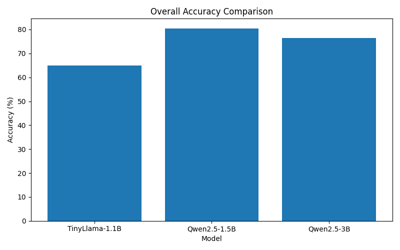
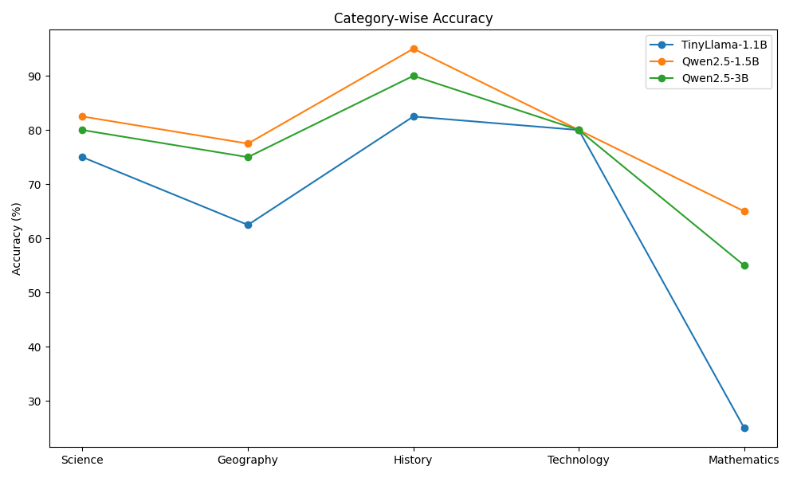
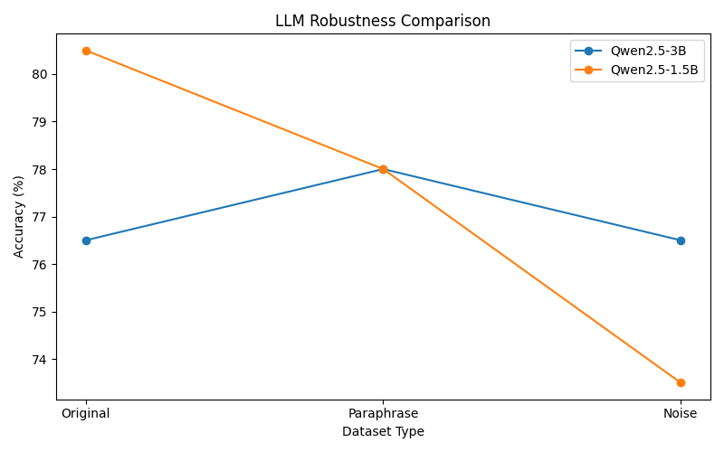

# Open Source LLM Benchmark: Accuracy and Robustness Evaluation

---

## Table of Contents

1. [Project Overview](#1-project-overview)
2. [Research Objective](#2-research-objective)
3. [Models Evaluated](#3-models-evaluated)
4. [Dataset Description](#4-dataset-description)
5. [Experimental Setup](#5-experimental-setup)
6. [Evaluation Methodology](#6-evaluation-methodology)
7. [Benchmark Results](#7-benchmark-results)
8. [Category-wise Performance](#8-category-wise-performance)
9. [Robustness Evaluation](#9-robustness-evaluation)
10. [Robustness Drop Analysis](#10-robustness-drop-analysis)
11. [Visualizations](#11-visualizations)
12. [Project Structure](#12-project-structure)
13. [How To Run](#13-how-to-run)
14. [Key Findings](#14-key-findings)
15. [Limitations](#15-limitations)
16. [Future Work](#16-future-work)
17. [License](#17-license)

---

## 1. Project Overview

The growing availability of small, open-source large language models has created a need for systematic evaluation beyond standard leaderboard benchmarks. Many widely used benchmarks — such as MMLU or HellaSwag — are evaluated under controlled conditions with clean, well-formed inputs. However, real-world usage rarely conforms to these conditions. Users make spelling errors, rephrase questions in unexpected ways, and query models in contexts that differ from training distributions.

This project addresses two related gaps. First, there is limited comparative evaluation of small open-source LLMs (under 4B parameters) on domain-specific factual question answering. Second, most benchmarks measure accuracy on clean inputs only, providing no insight into how models behave when inputs are imperfect.

To address both, this project constructs a custom 200-question benchmark dataset spanning five knowledge domains and evaluates three open-source models under three distinct input conditions: original questions, semantically paraphrased questions, and typographically noisy questions. The goal is to measure not only accuracy, but **robustness** — the degree to which model performance degrades under realistic input variation.

---

## 2. Research Objective

This project investigates three core questions:

**2.1 Comparative accuracy across model sizes**
Do larger parameter counts consistently translate to higher benchmark accuracy? This experiment compares models ranging from 1.1B to 3B parameters on identical question sets.

**2.2 Effect of input transformation on performance**
How does model accuracy change when questions are paraphrased (preserving meaning) or corrupted with realistic typing errors? This isolates whether models rely on surface-level pattern matching or deeper semantic understanding.

**2.3 Robustness degradation measurement**
Robustness drop is defined as the performance difference between the original and transformed input conditions. A model that maintains high accuracy under both paraphrase and noise conditions is considered more robust than one whose accuracy collapses under minor variation.

---

## 3. Models Evaluated

Three open-source instruction-tuned models were selected to represent a range of parameter scales accessible on consumer hardware.

## Models Evaluated

| Model | Source |
|------|--------|
| TinyLlama-1.1B-Chat-v1.0 | https://huggingface.co/TinyLlama/TinyLlama-1.1B-Chat-v1.0 |
| Qwen2.5-1.5B-Instruct | https://huggingface.co/Qwen/Qwen2.5-1.5B-Instruct |
| Qwen2.5-3B-Instruct | https://huggingface.co/Qwen/Qwen2.5-3B-Instruct |


All models are instruction-tuned variants designed for conversational and question-answering tasks. Comparing models within this parameter range is particularly relevant because these sizes are deployable on consumer GPUs without quantization, making them candidates for local and edge deployment scenarios. The Qwen2.5-1.5B and Qwen2.5-3B pair additionally allows isolation of the effect of scale within a single model family, while TinyLlama provides a cross-architecture reference point.

---

## 4. Dataset Description

The benchmark consists of 200 factual questions drawn from five knowledge domains, with uniform distribution across categories and difficulty levels.

**4.1 Domain Distribution**

| Category | Questions |
|---|---|
| Science | 40 |
| Geography | 40 |
| History | 40 |
| Technology | 40 |
| Mathematics | 40 |
| **Total** | **200** |

Each category contains questions at Easy, Medium, and Hard difficulty levels, enabling analysis of model performance across knowledge depth as well as domain.

**4.2 Evaluation Versions**

Three versions of the dataset were constructed to support the robustness experiments.

**Original Dataset** — Questions in their standard, clean form. This is the baseline evaluation condition.

**Paraphrase Dataset** — Each question was manually rewritten to preserve the exact meaning while using different vocabulary and sentence structure. For example:

> Original: *What is the chemical formula for water?*
> Paraphrase: *Which formula represents the chemical composition of water?*

Paraphrase testing evaluates whether models rely on semantic understanding or surface-level lexical matching. A model that answers the original correctly but fails the paraphrase version is likely exploiting shallow keyword cues rather than comprehending the question.

**Noise Dataset** — Each question was introduced with 3–4 realistic typing errors, including transposed characters, missing letters, doubled letters, and common keyboard adjacency mistakes. For example:

> Original: *What is the chemical formula for water?*
> Noisy: *Wat is teh chemicla forumla for water?*

Noise testing evaluates resilience to imperfect user input, which is a common condition in real-world deployment. Models that maintain performance under noisy conditions are more suitable for practical applications.

---

## 5. Experimental Setup

**5.1 Hardware**

| Component | Specification |
|---|---|
| GPU | NVIDIA RTX 4060 8GB VRAM |
| OS | Windows |

All models were evaluated using FP16 (float16) inference on the GPU. The 8GB VRAM constraint was a key factor in selecting models under 4B parameters.

**5.2 Software**

| Library | Purpose |
|---|---|
| Python | Core scripting |
| PyTorch | Model inference backend |
| Hugging Face Transformers | Model loading and pipeline |
| Pandas | Dataset handling and result aggregation |

**5.3 Inference Configuration**

Models were evaluated using the Hugging Face `text-generation` pipeline with the following settings:

```python
pipeline(
    "text-generation",
    model=model,
    tokenizer=tokenizer,
    do_sample=False,        # Greedy decoding for deterministic outputs
    max_new_tokens=50,      # Sufficient for short factual answers
)
```

Greedy decoding (`do_sample=False`) was used to ensure reproducibility. Temperature sampling was disabled to eliminate stochasticity from evaluation results.

---

## 6. Evaluation Methodology

**6.1 Prediction Generation**

Each model was prompted with benchmark questions formatted using its respective instruction template. The generated output was extracted, stripped of prompt artifacts, and normalized for comparison.

**6.2 Answer Matching**

Generated answers were compared against ground-truth answers using normalized string matching. Normalization included lowercasing, removal of punctuation, and whitespace normalization to reduce false negatives caused by formatting differences rather than factual errors.

**6.3 Accuracy Metric**

The primary evaluation metric is accuracy:

$$\text{Accuracy} = \frac{\text{Correct Predictions}}{\text{Total Questions}}$$

For robustness evaluation, the drop metric is defined as:

$$\text{Robustness Drop} = \text{Accuracy}_{\text{original}} - \text{Accuracy}_{\text{transformed}}$$

A lower drop value indicates greater robustness to input variation.

---

## 7. Benchmark Results

**Overall accuracy on the full 200-question benchmark (original questions):**

| Model | Parameters | Overall Accuracy |
|---|---|---|
| TinyLlama-1.1B-Chat-v1.0 | 1.1B | 65.0% |
| Qwen2.5-1.5B-Instruct | 1.5B | **80.5%** |
| Qwen2.5-3B-Instruct | 3B | 76.5% |

Qwen2.5-1.5B achieved the highest overall accuracy despite having fewer parameters than the 3B variant, suggesting that model architecture, training data, and instruction tuning quality can outweigh raw parameter count in this regime.

---

## 8. Category-wise Performance

**Accuracy (%) per domain on the original 200-question benchmark:**

| Model | Science | Geography | History | Technology | Mathematics |
|---|---|---|---|---|---|
| TinyLlama-1.1B | 75.0 | 62.5 | 82.5 | 80.0 | 25.0 |
| Qwen2.5-1.5B | 82.5 | 77.5 | **95.0** | 80.0 | 65.0 |
| Qwen2.5-3B | 80.0 | 75.0 | 90.0 | 80.0 | 55.0 |

**Observations:**

- All three models perform weakest on Mathematics, with TinyLlama-1.1B scoring only 25.0%, indicating limited numerical and formal reasoning capability at this parameter scale.
- History is the strongest category across all models, likely reflecting high representation of historical facts in pretraining corpora.
- Technology performance is consistent across models (80.0% for all), suggesting this domain is relatively well-saturated in open-source model training data.
- The performance gap between Qwen2.5-1.5B and Qwen2.5-3B is most pronounced in Mathematics (65.0% vs 55.0%), where the smaller model outperforms the larger one by 10 percentage points.

---

## 9. Robustness Evaluation

Robustness experiments were conducted on Qwen2.5-1.5B-Instruct and Qwen2.5-3B-Instruct using the three dataset versions. Each model was evaluated on the same 200 questions across original, paraphrase, and noisy conditions.

| Condition | Description |
|---|---|
| Original | Clean, unmodified questions |
| Paraphrase | Semantically equivalent rewrites |
| Noise | Questions with 3–4 realistic typing errors |

**Robustness results across input conditions:**

| Model | Original | Paraphrase | Noise |
|---|---|---|---|
| Qwen2.5-1.5B-Instruct | 80.5% | 78.0% | 73.5% |
| Qwen2.5-3B-Instruct | 80.5% | 78.0% | 80.5% |

Qwen2.5-1.5B shows a consistent degradation from original to paraphrase to noise conditions, while Qwen2.5-3B recovers its original accuracy under noisy input after a 2.5 percentage-point drop under paraphrasing.

---

## 10. Robustness Drop Analysis

**Performance degradation relative to original accuracy:**

| Model | Paraphrase Drop | Noise Drop |
|---|---|---|
| Qwen2.5-3B-Instruct | 2.5% | 0.0% |
| Qwen2.5-1.5B-Instruct | 2.5% | 7.0% |

**Analysis:**

Qwen2.5-3B demonstrates substantially greater robustness to noisy input (0.0% drop) compared to Qwen2.5-1.5B (−7.0% drop). This suggests that the additional capacity in the 3B model contributes meaningfully to noise tolerance, even when it does not translate to higher accuracy on clean inputs.

The larger paraphrase drop for Qwen2.5-1.5B (−2.5% vs −1.5%) indicates that the smaller model is somewhat more sensitive to surface-level wording changes. However, both models degrade modestly under paraphrase, suggesting that instruction tuning provides reasonable semantic generalization at both scales.

The noise drop discrepancy is the most significant finding: a 7% accuracy decline in Qwen2.5-1.5B under realistic typo conditions indicates that smaller models may be more brittle to subword-level token disruption caused by misspellings. This has practical implications for applications that accept free-form text input from users.

---

## 11. Visualizations

**Model Accuracy Comparison**



**Category-wise Performance Breakdown**



**Robustness Across Input Conditions**



---

## 12. Project Structure

```
.
├── data/
│   ├── IndianLLMBenchmark_v1.csv                    # Original 200-question benchmark
│   ├── IndianLLMBenchmark_original_full.csv         # Full benchmark, original format
│   ├── IndianLLMBenchmark_paraphrase_full.csv       # Full benchmark, paraphrased questions
│   ├── IndianLLMBenchmark_noise_full.csv            # Full benchmark, noisy questions
│   ├── IndianLLMBenchmark_original_test.csv         # 20-question pilot, original
│   ├── IndianLLMBenchmark_paraphrase_test.csv       # 20-question pilot, paraphrased
│   └── IndianLLMBenchmark_noise_test.csv            # 20-question pilot, noisy
│
├── figures/
│   ├── model_comparison.png                         # Overall accuracy bar chart
│   ├── category_comparison.png                      # Category-wise grouped bar chart
│   └── robustness_comparison.png                    # Robustness line/bar chart
│
├── outputs/
│   ├── predictions_tinyllama.csv                    # TinyLlama raw predictions
│   ├── predictions_qwen15b.csv                      # Qwen2.5-1.5B raw predictions
│   └── predictions_qwen3b.csv                       # Qwen2.5-3B raw predictions
│
├── results/
│   ├── evaluation_results.csv                       # Aggregated accuracy results
│   ├── category_results.csv                         # Category-wise breakdown
│   └── robustness_results.csv                       # Robustness experiment results
│
├── scripts/
│   ├── benchmark_runner.py                          # Inference script for TinyLlama
│   ├── benchmark_runner_qwen15b.py                  # Inference script for Qwen2.5-1.5B
│   ├── evaluate.py                                  # Main evaluation script
│   ├── evaluate_original_test.py                    # Pilot evaluation (original)
│   ├── evaluate_paraphrase.py                       # Robustness evaluation (paraphrase)
│   ├── evaluate_noise.py                            # Robustness evaluation (noise)
│   ├── create_graph.py                              # Overall accuracy visualization
│   ├── create_category_graph.py                     # Category-wise visualization
│   └── create_robustness_graph.py                   # Robustness visualization
│
├── requirements.txt
└── README.md
```

---

## 13. How To Run

**Installation**

```bash
pip install -r requirements.txt
```

**Run Inference**

```bash
# TinyLlama-1.1B
python scripts/benchmark_runner.py

# Qwen2.5-1.5B
python scripts/benchmark_runner_qwen15b.py
```

**Evaluate Predictions**

```bash
# Overall accuracy
python scripts/evaluate.py

# Pilot set (20 questions)
python scripts/evaluate_original_test.py

# Robustness: paraphrase
python scripts/evaluate_paraphrase.py

# Robustness: noise
python scripts/evaluate_noise.py
```

**Generate Visualizations**

```bash
python scripts/create_graph.py
python scripts/create_category_graph.py
python scripts/create_robustness_graph.py
```

---

## 14. Key Findings

**F1 — Model size does not reliably predict benchmark accuracy.**
Qwen2.5-1.5B outperformed Qwen2.5-3B on the overall benchmark (80.5% vs 76.5%), demonstrating that instruction tuning quality and training data composition can be more determinative than parameter count in the sub-4B regime.

**F2 — Mathematics represents a consistent failure mode at small scale.**
All three models underperformed on the Mathematics category relative to other domains. TinyLlama-1.1B scored only 25.0%, and even Qwen2.5-1.5B reached only 65.0%, suggesting that formal and numerical reasoning remains a significant weakness for models below 4B parameters.

**F3 — Input variation affects the two Qwen models differently.** 
Qwen2.5-1.5B shows a monotonic accuracy decline from original to paraphrase to noise conditions, while Qwen2.5-3B returns to its original accuracy under noisy input. This highlights that robustness does not necessarily decrease monotonically with increasing input corruption.

**F4 — Robustness to noise scales with model size.**
Qwen2.5-3B showed zero accuracy drop under noisy input conditions (0.0%), while Qwen2.5-1.5B dropped by 7.0%. This suggests that larger models within the same family develop stronger noise tolerance, even when overall accuracy is comparable.

**F5 — Standard accuracy benchmarks are insufficient for deployment evaluation.**
The robustness experiments surface performance gaps that accuracy alone cannot reveal. Two models with identical accuracy on clean inputs can differ substantially in their behavior under imperfect conditions.

---

## 15. Limitations

**Dataset scope.** The benchmark contains 200 questions, which, while structured across five domains and three difficulty levels, is relatively small for drawing broad conclusions. Domain-specific results in particular should be interpreted with caution.

**Evaluation methodology.** Answer matching relies on string normalization rather than semantic matching. Some correct responses may be marked incorrect due to minor phrasing differences that normalization does not resolve.

**Model selection.** Only three models were evaluated. Results may not generalize to other architectures, quantized variants, or models with different instruction-tuning procedures.

**Noise design.** The noisy question set uses a fixed rate of 3–4 errors per question. Real-world noise distributions vary in type and density, and findings here may not fully represent the space of possible input corruptions.

**Metric coverage.** A single accuracy metric is used throughout. More nuanced metrics such as semantic similarity, calibration, or confidence estimation would provide a richer characterization of model behavior.

---

## 16. Future Work

**Scale to larger models.** Evaluating models in the 7B–13B range would clarify whether the robustness advantages observed for the 3B model continue to hold at larger scales.

**MMLU comparison.** Running the same models on MMLU would allow direct comparison of the custom benchmark against an established standard and would test whether domain-specific results generalize.

**Semantic similarity evaluation.** Replacing or supplementing string matching with embedding-based similarity scores (e.g., BERTScore or cosine similarity over sentence embeddings) would reduce false negatives in evaluation.

**LLM-as-a-judge evaluation.** Using a larger, capable model as an automatic evaluator to assess answer correctness would enable open-ended answer formats and reduce sensitivity to surface-level phrasing.

**Multilingual expansion.** Extending the benchmark to Hindi and other Indian languages would evaluate cross-lingual robustness, which is particularly relevant for models intended for the Indian language context.

**Hallucination analysis.** Beyond correctness, examining cases where models produce confident but incorrect answers would add a reliability dimension to the evaluation.

---

## 17. License

This project is released under the [MIT License](LICENSE).

---

*This project was developed as an independent research initiative to study the accuracy and robustness of small open-source LLMs under realistic input conditions.*
